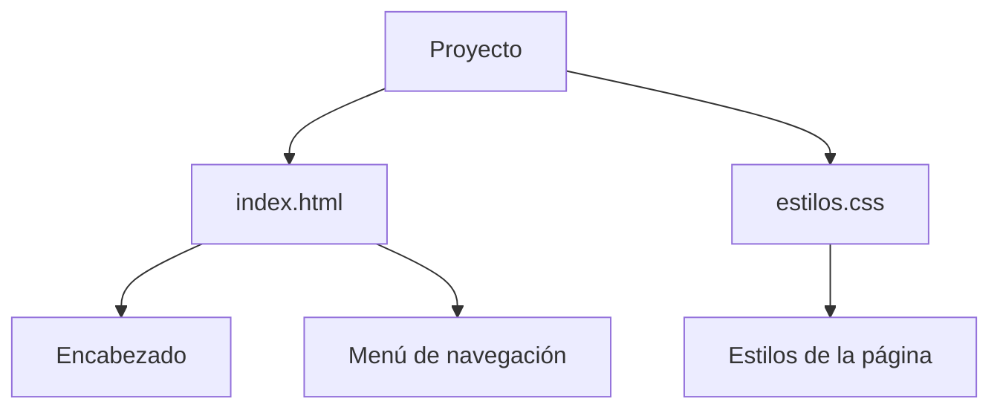

# Laboratorio 02: Ramas, Merge y Conflictos

Proyecto web desarrollado para practicar el uso de ramas, merge y resolución de conflictos en Git.
El proyecto contiene una página HTML con estilos CSS y una navegación básica.

## Tabla de contenidos
- Descripción
- Instalación
- Uso
- Estado de funcionalidades
- Tareas pendientes
- Arquitectura
- Contribuidores

## Descripción

El proyecto corresponde al Laboratorio 02 y está enfocado en practicar el trabajo con ramas, merge y conflictos utilizando Git. La página principal contiene una estructura HTML básica, un título y un menú de navegación.

## Instalación
git clone https://github.com/TU-USUARIO/laboratorio-readme.git
cd laboratorio-readme
## Uso
#Abrir el archivo principal
index.html

#Para visualizar el proyecto:

#Abrir index.html en un navegador web

## Estado de funcionalidades

| Funcionalidad | Estado |
|---|---|
| Página HTML principal | ✅ Completado |
| Hoja de estilos CSS | ✅ Completado |
| Menú de navegación | ✅ Completado |
| Diseño completo de las secciones | ⏳ Pendiente |

## Tareas pendientes

- [ ] Completar el contenido de las secciones de navegación.

- [ ] Mejorar el diseño visual de la página.

- [ ] Agregar contenido a las páginas de Cursos y Contacto.

- [ ]  Realizar pruebas de merge y resolución de conflictos.

## Arquitectura

## Contribuidores

- Gabriel Martin Nunez Carpio — GitHub: TU-USUARIO
